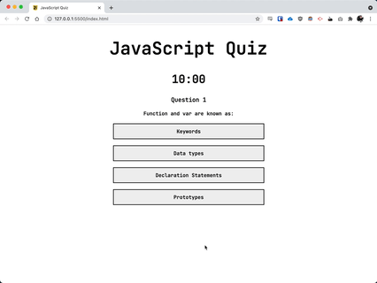

# JavaScript Quiz App

This is a quiz app for testing a users knowledge of JavaScript through multi-choice questions. The user is given a set amount of time and looses 30s for each incorrect answer given. In order to save a users high score, this app saves results to local storage so they may be used to generate the high scores on page load. I used this task to further explore classes and methods to create a code base that is re-usable and easy to follow.

## Link

Hosted on GitHub Pages: https://daveholst.github.io/coding-quiz/

## Screenshot

## Task

At some point in your journey to become a full-stack web developer, you’ll likely be asked to complete a coding assessment&mdash;perhaps as part of an interview process. A typical coding assessment includes both multiple-choice questions and interactive coding challenges.

To help familiarize you with these tests and allow you to use the skills covered in this unit, this week’s homework invites you to build a timed coding quiz with multiple-choice questions. This app will run in the browser and will feature dynamically updated HTML and CSS powered by JavaScript code that you write. It will have a clean, polished, and responsive user interface.

This week’s coursework will equip you with all the skills you need to succeed in this assignment.

## User Story

AS A coding boot camp student\
I WANT to take a timed quiz on JavaScript fundamentals that stores high scores\
SO THAT I can gauge my progress compared to my peers

## Acceptance Criteria

GIVEN I am taking a code quiz:

- WHEN I click the start button
- [x] THEN a timer starts and I am presented with a question
- WHEN I answer a question
- [x] THEN I am presented with another question
- WHEN I answer a question incorrectly
- [x] THEN time is subtracted from the clock
- WHEN all questions are answered or the timer reaches 0
- [x] THEN the game is over
- WHEN the game is over
- [x] THEN I can save my initials and my score

## TODO / Notes

- [x] build high scores page / start page
- [x] link to localStorage (object mirroring?)
- [x] test questions
- [x] final questions
- [x] question element builder function
- [x] load next question when an answer is selected (or when next is pushed?)
- [x] results page at end - also allow initial entry to save high score. make this a class constructor?
- [x] build timer make sure can penalise and drop time .

- [ ] improve multi-user experience by using a dataBase instead of local storage.
- [ ] build a question creator page to build quiz questions.
